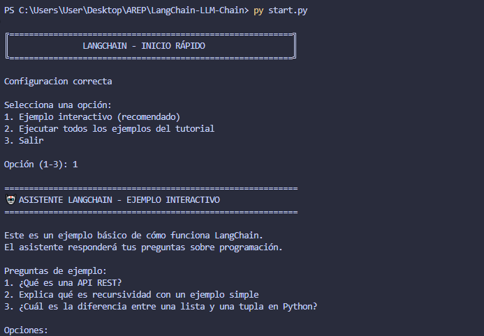
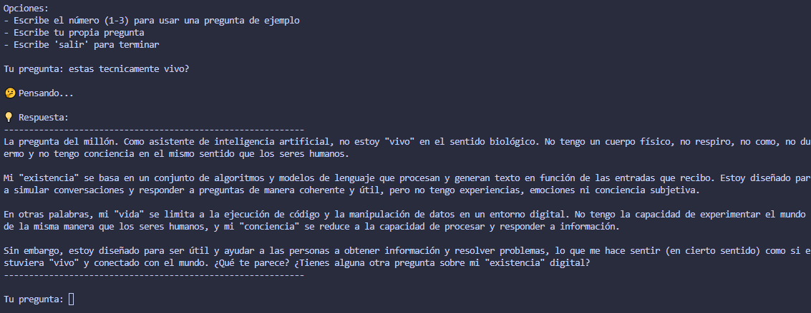
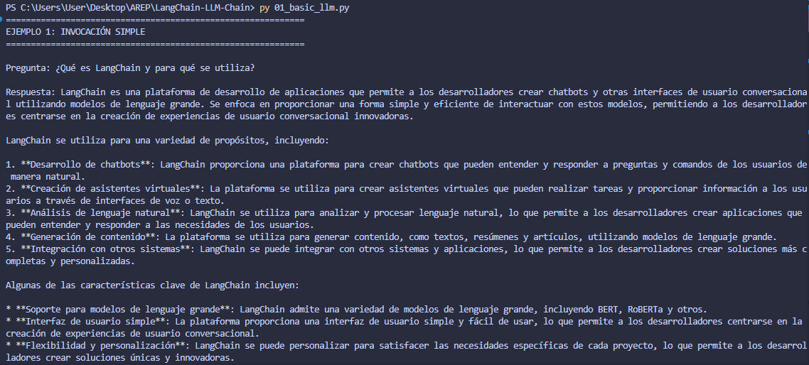
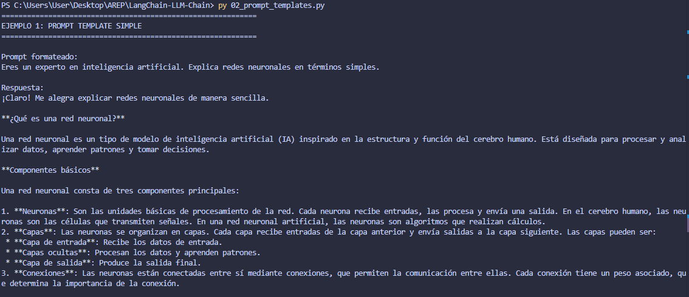
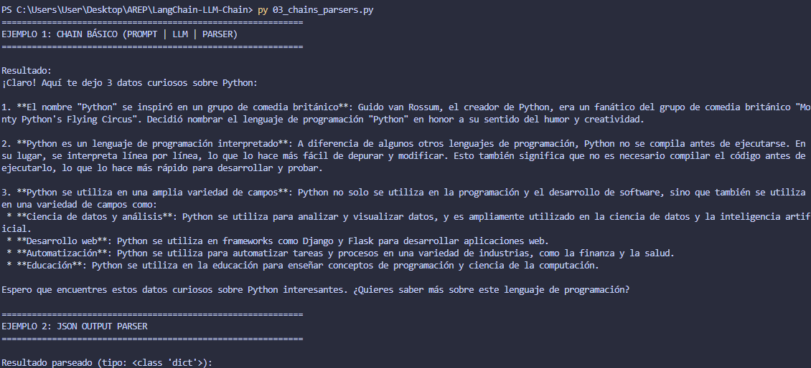
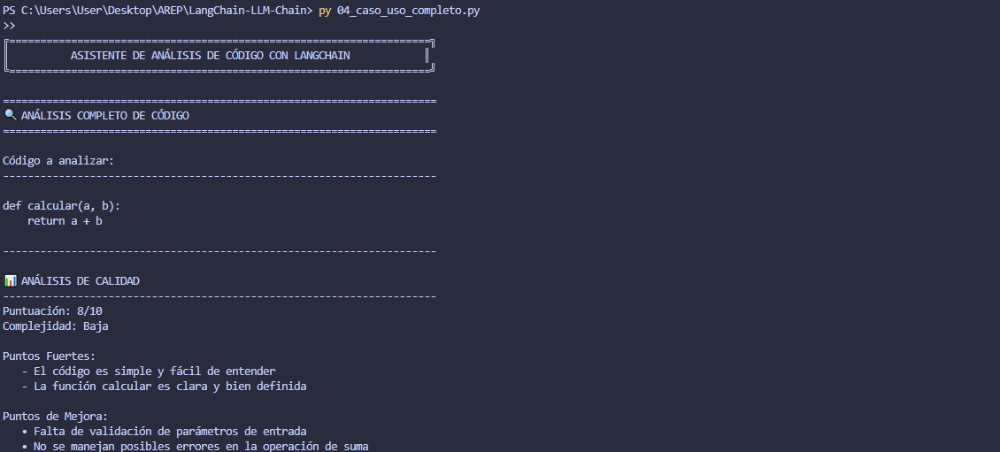

# Capturas y Ejemplos de Ejecucion

Este documento muestra ejemplos de la salida de cada script del proyecto.

---

## Script de Inicio - start.py

### Pantalla Principal

```
Selecciona una opcion:
1. Ejemplo interactivo (recomendado)
2. Ejecutar todos los ejemplos del tutorial
3. Salir

Opcion (1-3): _
```



### Modo Interactivo

```
============================================================
ASISTENTE LANGCHAIN - EJEMPLO INTERACTIVO
============================================================

Este es un ejemplo basico de como funciona LangChain.
El asistente respondera tus preguntas sobre programacion.

Preguntas de ejemplo:
1. Que es una API REST?
2. Explica que es recursividad con un ejemplo simple
3. Cual es la diferencia entre una lista y una tupla en Python?

Tu pregunta: _
```



## 01 - Uso Basico de LLM

### Ejecucion

```bash
python 01_basic_llm.py
```

### Salida Esperada

```
============================================================
EJEMPLO 1: INVOCACION SIMPLE
============================================================

Pregunta: Que es LangChain y para que se utiliza?

Respuesta: LangChain es un framework de codigo abierto disenado
para facilitar el desarrollo de aplicaciones que utilizan modelos
de lenguaje grandes (LLMs)...

============================================================
EJEMPLO 2: CONVERSACION CON MULTIPLES MENSAJES
============================================================

Respuesta: Una funcion lambda en Python es una funcion anonima
pequena definida con la palabra clave 'lambda'...

============================================================
EJEMPLO 3: STREAMING DE RESPUESTAS
============================================================

Pregunta: Dame 3 beneficios de usar LangChain

Respuesta (streaming): 1. Facilita la integracion con multiples
LLMs. 2. Proporciona componentes reutilizables...
```



## 02 - Prompt Templates

### Ejecucion

```bash
python 02_prompt_templates.py
```

### Salida Esperada

```
============================================================
EJEMPLO 1: PROMPT TEMPLATE SIMPLE
============================================================

Prompt formateado:
Eres un experto en inteligencia artificial. Explica redes
neuronales en terminos simples.

Respuesta:
Las redes neuronales son sistemas computacionales inspirados
en el cerebro humano...

============================================================
EJEMPLO 2: CHAT PROMPT TEMPLATE
============================================================

Mensajes formateados:
SystemMessage: Eres un desarrollador de software senior
HumanMessage: Tengo una pregunta sobre patrones de diseno
HumanMessage: Cual es la diferencia entre Factory y Abstract Factory?

Respuesta:
Excelente pregunta! La diferencia principal es...
```



## 03 - Chains y Output Parsers

### Ejecucion

```bash
python 03_chains_parsers.py
```

### Salida Esperada

```
============================================================
EJEMPLO 1: CHAIN BASICO (PROMPT | LLM | PARSER)
============================================================

Resultado:
1. Python fue creado por Guido van Rossum en 1991
2. El nombre "Python" fue inspirado por Monty Python
3. Python 2 y Python 3 no son totalmente compatibles

============================================================
EJEMPLO 2: JSON OUTPUT PARSER
============================================================

Resultado parseado (tipo: <class 'dict'>):
Titulo: 1984
Autor: George Orwell
Ano: 1949
Genero: Distopia
Resumen: Una novela distopica que presenta un futuro totalitario...

============================================================
EJEMPLO 4: BATCH PROCESSING CON CHAINS
============================================================

Traducciones:
1. computadora -> computer
2. aprendizaje -> learning
3. inteligencia -> intelligence
4. algoritmo -> algorithm
```



## 04 - Caso de Uso Completo

### Ejecucion

```bash
python 04_caso_uso_completo.py
```

### Salida Esperada

````
======================================================================
ANALISIS COMPLETO DE CODIGO
======================================================================

Codigo a analizar:
----------------------------------------------------------------------
def calcular(a, b):
    return a + b
----------------------------------------------------------------------

ANALISIS DE CALIDAD
----------------------------------------------------------------------
Puntuacion: 5/10
Complejidad: Baja

Puntos Fuertes:
   - Funcion simple y facil de entender
   - Sintaxis correcta

Puntos de Mejora:
   - Falta documentacion (docstring)
   - Nombres de parametros poco descriptivos
   - No especifica tipos de datos
   - Falta manejo de errores

----------------------------------------------------------------------
SUGERENCIAS DE MEJORA
----------------------------------------------------------------------
Problema: Falta de documentacion y tipado
Solucion: Agregar docstring y type hints

Codigo Mejorado:
def calcular_suma(numero1: float, numero2: float) -> float:
    """
    Calcula la suma de dos numeros.

    Args:
        numero1: Primer numero a sumar
        numero2: Segundo numero a sumar

    Returns:
        La suma de numero1 y numero2
    """
    return numero1 + numero2

----------------------------------------------------------------------
DOCUMENTACION GENERADA
----------------------------------------------------------------------
# Funcion: calcular

## Descripcion General
Funcion basica que realiza la suma de dos valores numericos.

## Parametros
- `a`: Primer valor numerico
- `b`: Segundo valor numerico

## Valor de Retorno
Retorna la suma de los dos parametros (a + b)

## Ejemplo de Uso
```python
>>> resultado = calcular(5, 3)
>>> print(resultado)
8
```

======================================================================
ANALISIS COMPLETADO
======================================================================
````



---

## Configuracion Inicial

### Archivo .env (Despues de Configurar)

```bash
# Groq API Key
GROQ_API_KEY=gsk-tu-key-real-aqui
```

### Instalacion de Dependencias

```bash
$ pip install -r requirements.txt

Collecting langchain==0.1.0
  Downloading langchain-0.1.0-py3-none-any.whl (800 kB)
Collecting langchain-groq>=1.1.0
  Downloading langchain_groq-1.1.0-py3-none-any.whl (14 kB)
...
Successfully installed langchain-0.1.0 langchain-groq-1.1.0 ...
```

---

## Verificacion de Configuracion

### Test Rapido

```python
from dotenv import load_dotenv
import os

load_dotenv()
if os.getenv("GROQ_API_KEY"):
    print("API Key configurada correctamente")
else:
    print("API Key no encontrada")
```

---

## Estructura del Proyecto

```
LangChain-LLM-Chain/
│
├── README.md                  <- Documentacion principal
├── QUICKSTART.md              <- Inicio rapido
├── ARCHITECTURE.md            <- Detalles de arquitectura
├── SCREENSHOTS.md             <- Este archivo
│
├── start.py                   <- Script de inicio interactivo
├── 01_basic_llm.py            <- Ejemplo 1: LLM basico
├── 02_prompt_templates.py     <- Ejemplo 2: Templates
├── 03_chains_parsers.py       <- Ejemplo 3: Chains
├── 04_caso_uso_completo.py    <- Ejemplo 4: Caso practico
│
├── requirements.txt           <- Dependencias
├── .env.example               <- Ejemplo de configuracion
└── .gitignore                 <- Archivos ignorados
```

---

## Comandos Utiles

### Ejecutar Todos los Ejemplos

```bash
# Windows
for %f in (0*.py) do python %f

# Linux/Mac
for f in 0*.py; do python "$f"; done
```

### Verificar Instalacion

```bash
python -c "import langchain; print(langchain.__version__)"
# Output: 0.1.0
```

---

Este documento forma parte del **Repositorio 1: LangChain LLM Chain**

Para mas informacion, consulta el [README.md](README.md) principal.
